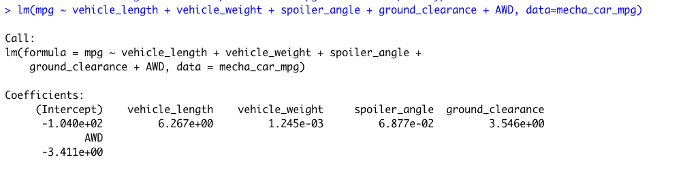
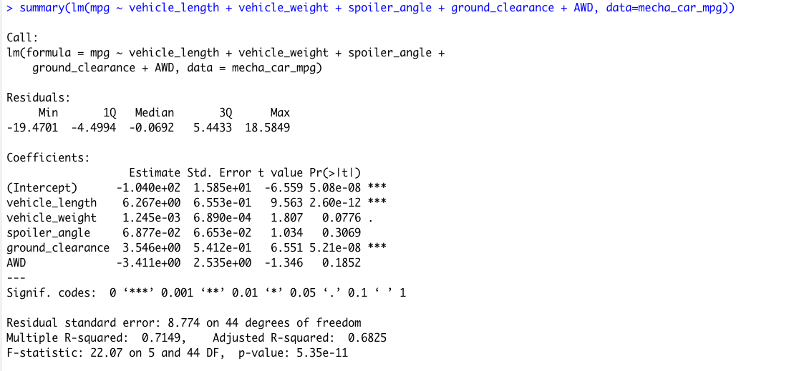
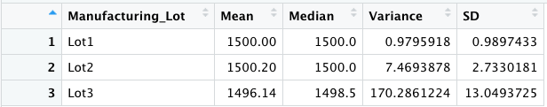
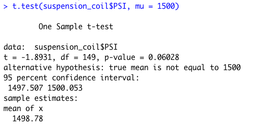
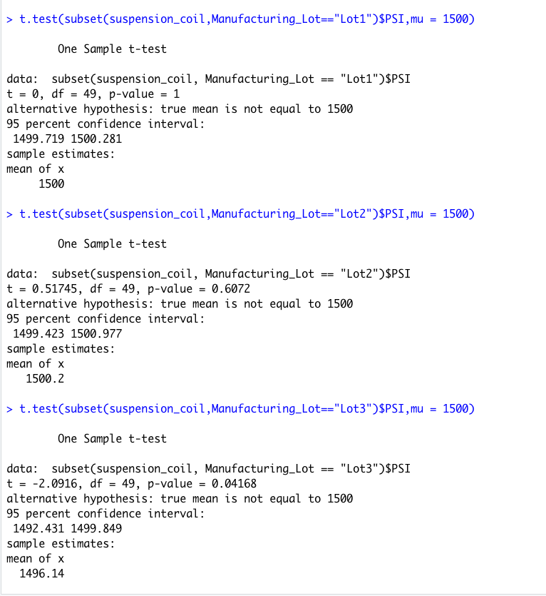

# **Module15-MechaCar_Statistical_Analysis**
# **Statistics and R**

## **Overview**

### The objective of this project is to analyze manufacturing data that could affect the manufacturing process of the new car prototype and to compare vehicle performance across different manufacturer lots. The data includes vehicle vehicle_length, vehicle_weight, spoiler_angle, ground_clearance, AWD, MPG, and PSI.

## **Deliverable 1 - Linear Regression to Predict MPG**

### **Linear Regression**

### **Summary**

### - Which variables/coefficients provided a non-random amount of variance to the mpg values in the dataset?

###     According to the results, vehicle length, ground clearance, and intercept provide a non-random amount of variance to the mpg values.

### - Is the slope of the linear model considered to be zero? Why or why not?

###     The slope is not 0 since the p-value is  0.05.

### - Does this linear model predict mpg of MechaCar prototypes effectively? Why or why not?

###     The Adjusted R-square of 0.6825 concludes that this linear model predicts the mpg of MechaCar prototypes relatively well.
###     The Multiple R-squared value is 0.7149, which means roughly 71% of the time the model will predict mpg values correctly. 
###     There are probably other factors that were not captured in the datasaet that contribute to the mpg variability of the MechaCar prototypes.

## **Deliverable 2 - Summary Statistics on Suspension Coils**

### The design specifications for the MechaCar suspension coils dictate that the variance of the suspension coils must not exceed 100 pounds per square inch. Does the current manufacturing data meet this design specification for all manufacturing lots in total and each lot individually? Why or why not?

### **Total Summary**

### **Lot Summary**

### The variance for the entire dataset (62.29) indicates that the current manufacturing data meets the 100 pounds per square inch variance limitation. However, when separated into three lots, Lot 1 (variance = 0.98) and Lot 2 (variance = 7.47) are both within design specifications, while lot 3 (variance = 170.29) shows a much higher variance and exceeds the manufacturers specs. Because the lots are chosen randomly, there is a possiblity that a third of the lot does not meet the necessarsuspension coils requirements.

## **Deliverable 3 - T-Tests on Suspension Coils**

### Summarized interpretation and findings for the t-test results

### For ALL manufacturing lots, Lot 1, and Lot 2 at a significance level of 0.05, we fail to reject the null hypothesis since the p-values are equal to 0.06028, 1, and 0.6072 respectively.  However, for lot 3 we can reject the null hypothesis since the p-value is equal to 0.04168.

### **t.test on PSI across ALL manufacturing lots**

### **t.test on PSI for EACH manufacturing lots**

## **Deliverable 4 - Study Design: MechaCar vs Competition**

### Other statistical study design that can be performed to determine MechaCar's standing against its competitors is a linear regression on city and highway fuel efficiency. We can make a null hypothesis stating that its fuel efficiency is not different from the competitors and our Alternative would be the opposite.  We will use t-test after collecting data from different types of competitor vehicles. Our t-test will be comparing the population of all types of competitor vehicles.  The metrics that can be included in this analysis are:

###     - City and highway fuel efficiency as dependent variable
###     - Horse power as independent variable
###     - Vehicle weight as independent variable
###     - AWD capabilities as independent variable
###     - MPG as independent variable 
###     - In addition to the MPG, AWD, and vehicle weight data that we already have, we have to collect fuel efficiency and horse power data for the sample data set.
